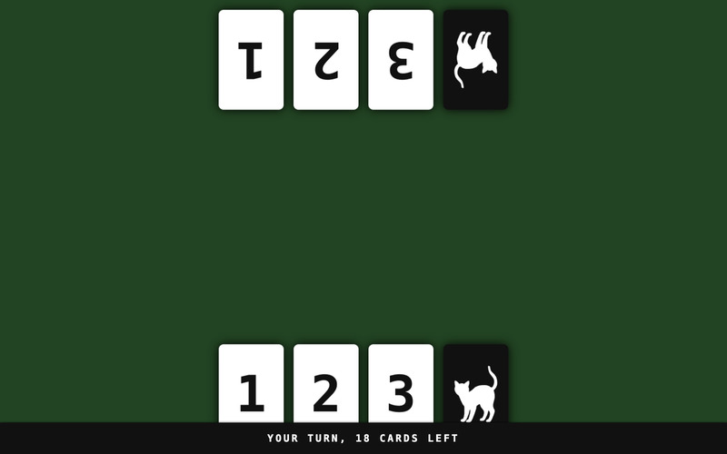

# Meow or Never

1. Play a card equal to or higher than the last card.
2. If you can’t, pick a lower one to swap.
3. You may play the Black Cat anytime.
4. The game ends when the last Black Cat has been played or
	when there are no more cards left to draw.
5. Highest hand total wins.

A quick card game for up to four players in 13 kilobytes for
[js13kGames][js13kgames] 2025.
The theme was "Black Cat".

Designed for your phone when you want to quickly play a round with friends,
but no one has a deck of cards with them.

## Build Requirements

[esbuild][esbuild] is used for minification. You can get it with `npm`:

	$ npm install --global esbuild

[js13kgames]: http://js13kgames.com/entries/2025
[play]: https://hhsw.de/sites/proto/js13k2025/
[esbuild]: https://github.com/evanw/esbuild
